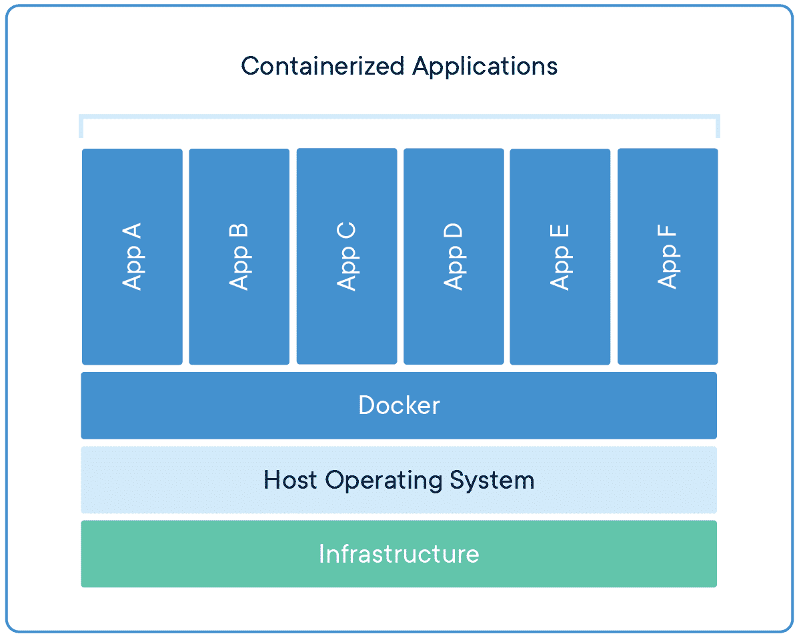

# DevOps Projects

## Descrição

Meu portfólio DevOps, consiste em um repositório onde cada pasta do projeto é equivalente a uma camada de estudos da área de DevOps, tendo neste projeto o seguinte:

- Scripts em Python e Bash
- Virtualização utilizando Vagrant
- Administração de sistemas e conceitos de redes
- Containerização utilizando Docker e Kubernetes
- CI/CD utiizando Jenkins em microsserviços
- IaaC com ferramentas como Ansible e Terraform
- Diversas soluções da AWS, como EC2, S3, Cloudformation e etc.

## Tabela de conteúdo

- Tabela de Conteudo
  - [Introdução VMs](#introdução-vms)
  - [VProfile em VM](#vprofile-em-vm)
  - [Introdução Containers](#introdução-containers)
  - [Bash Scripts](#bash-scripts)
  - [AWS-Intro](#aws-intro)
  - [VProfile em AWS](#vprofile-em-aws)
  - [Refactor Vprofile AWS](#refactor-vprofile-aws)
  - [Revisão Git](#git-review)
  - [Jenkins](#jenkins-intro)
  - [Docker](#docker)
  - [Python](#python)
  - [Ansible](#ansible)
  - [CI/CD na aws](#ci-cd-aws)
- [Tecnologias](#tecnologias)

### Introdução VMs

Nesta branch está hospedado 8 máquinas virtuais, utilizando o Vagrant sendo cada uma uma variante da
forma que eu fiz, e dentro das pastas "ubuntu18" e "centos7" estão arquivos do histórico de comandos
usados, sendo também meu treino de
administração de sistemas

#### Pastas

- IaaC - VMs utilizando IaaC com scripts bash
  - website
    - Website estático hospedado usando apache httpd com script para automatizar o deploy
  - wordpress
    - Site feito em wordpress usando script para automatizar o deploy
- centos7
  - Máquina virtual simples
- data
  - Pasta compartilhada entre algumas VMs
- multi-vm
  - Vagrantfile utilizando múltiplas VMs
- ubuntu18
  - Máquina virtual simples
- website
  - Máquina virtual com serviço de httpd servindo uma página estática
- wordpress
  - Máquina virtual com wordpress instalado e configurado

### VProfile em VM

Nesta branch está hospedado um sistema feito utilizando Spring Boot que se utiliza de uma arquitetura que possui
cinco serviços principais, sendo eles Nginx para balanceamento de carga, uma aplicação em Java que é hospedada
no servidor Tomcat, serviço de mensageria com o RabbitMQ, serviço de cache utilizando o Memchached e banco
de dados utilizando o MySQL.
Para atender todas essas necessidades foram criadas 5 máquinas virtuais, todas num arquivo Vagrantfile e com duas
versões, uma sendo feita de forma manual e outra que é com IaaC

#### Pastas

- automated-provisioning
  - Vagrantfile único sendo provisionado usando scripts em shell
- manual-provisioning
  - Vagrantfile único servindo todos serviços de forma manual

### Introdução Containers

Nesta branch está hospedada três pastas, todas utilizando o Docker como ferramenta para se fazer o deploy de uma
aplicação, juntamente a uma máquina virtual, além da aplicação prática de microsserviços com uma aplicação inteira rodando no Docker

#### Pastas

- basics
  - VM com website estático rodando no servidor Apache
- microservices
  - VM que possui uma aplicação divida em microsserviços, sendo eles:
    - Frontend com Angular
    - API em Java para gerenciamento de produtos específicos
    - API em NodeJs para gerenciamento de usuários e dados gerais
    - Nginx servindo como API Gateway
- vprofile-containers
  - VM Configurada para ser exatamente o mesmo que o projeto anterior mas rodando em containers

### Bash Scripts

Nesta branch estão hospedados scripts, onde possuem diversos conceitos de lógica de programação e serviços de
automação usando o interpretador Bash

#### Scripts

- 1_firstscript.sh
  - Um script básico de hello world
- 2_websetup.sh
  - Script básico para automatizar o setup de um site no serviço de httpd
- 3_vars_websetup.sh
  - O mesmo script anterior mas com variáveis
- 4_dismantle_websetup
  - Script para remoção de todo o setup feito
- 5_args_websetup.sh
  - O mesmo script utilizando argumentos do terminal
- 6_system_status.sh
  - Script para ver o estado do sistema
- 7_testvars.sh
  - Script utilizado para se entender o conceito de parentesco e variáveis globais
- 8_user_input.sh
  - Script recebendo dados do usuário em tempo de execução
- 9_conditionals.sh
  - Script utilizando estrutura if simples
- 10_conditionals.sh
  - Script utilizando estrutura if-else
- 11_conditionals.sh
  - Script utilizando estrutura de if-else encadeado
- 12_monit.sh
  - Script para monitorar se o serviço de httpd está rodando
- 13_monit.sh
  - O mesmo script mas usando uma condicional diferente
- 14_for_loop.sh
  - Script usando loop básico com for
- 15_for_loop.sh
  - Script para automatizar a criação de usuários
- 16_while_loop.sh
  - Script básico usando while loop
- 17_while_loop.sh
  - O mesmo script mas infinito
- remote-web-setup/
  - Pasta onde possui scripts para se rodar em outras máquinas via ssh, com configuração anterior entre elas
  - 18_multios_websetup.sh
    - Script para automatizar o webdeploy, mas agora para suporte às distribuições Linux baseadas Debian
  - 19_webdeploy.sh
    - Script para se mandar o script anterior e rodar ele na máquina via ssh

### AWS-Intro

Nesta branch foi aperndido os conceitos de diversos serviços da AWS, basicamente aplicando todo o conhecimento
do curso até o momento no serviço de cloud

#### Ferramentas aprendidas

- EC2
  - Serviço de máquinas virtuais da AWS
- EBS
  - Serviço de partições e armazenamento virtual da AWS
- ELB
  - Serviço de balanceamento de carga da AWS
- Cloudwatch
  - Serviço de monitoramento e gatilhos da AWS
- EFS
  - Serviço de sistema de arquivos compartilhados entre Instâncias EC2 da AWS
- S3
  - Serviço de armazenamento de objetos da AWS
- RDS
  - Serviço de gerenciamento e configuração de bancos de dados da AWS

### VProfile em AWS

Esse projeto não possui uma branch própria, visto que ele é a mesma aplicação feita na [VProfile em VM]
(#vprofile-em-vm), e tendo o diferencial de ser totalmente escalável e feita com uma arquitetura para cloud

#### Passos do setup

1. Criação dos pares de segurança
2. Criação dos grupos de segurança
3. Lançar instâncias utilizando user data (Bash Scrripts)
4. Atualizar o IP para o mapeamento de nomes no serviço de Route 53
5. Buildar aplicação a partir do código fonte
6. Fazer o upload para um bucket S3
7. Baixar o artefato para a instância EC2 do Tomcat
8. Configurar ELB com HTTPS
9. Mapear o endpoint para um nome do website no Godaddy DNS
10. Configurar gatilhos para o escalonamento automático para instâncias Tomcat

### Refactor Vprofile AWS

Este projeto consiste em refatorar o trabalho do projeto anterior utilizando os serviços próprios da AWS,
sendo a principal mudança a utilização de máquinas virtuais para os serviços de banco de dados, RabbitMQ
e Memchached para RDS, ActiveMQ and Elasticache

#### Passos do setup

1. Criar par de segurança para o Beanstalk
2. Criar grupo de segurança para Elasticache, ActiveMQ e RDS
3. Criar:

- RDS
- Elasticache
- ActiveMQ

4. Criar ambiente do Beanstalk
5. Atualizar o grupo de segurança do backend para permitir o Beanstalk
6. Atualizar o grupo de segurança do backend para permitir tráfego interno
7. Inicializar banco de dados
8. Fazer configuração de health check para o Beanstalk
9. Adicionar o listener HTTPS para o ELB
10. Buildar aplicação com as variáveis do backend
11. Fazer deploy da aplicação no Beanstalk
12. Criar CDN usando o Cloudfront e certificado SSL
13. Atualizar o domínio no Godaddy

### Git Review

Uma breve revisão do git e seus comandos para se gerenciar repositórios de forma eficiente, necessário
para se ter uma boa integração entre as diversas equipes gerenciando o mesmo código e para se fazer deploys
automatizados

#### Comandos

- git clone
  - Comando para se clonar um repositório já existente na nuvem
- git fetch
  - Comando para se obter as informações que foram commitadas em um repositório
- git switch
  - Comando para se alterar e gerenciar branchs
- git restore
  - Comando para se alterar e restaurar versões de arquivos e diretórios
- git add
  - Comando para adicionar arquivos na área de staging
- git commit
  - Comando para se criar efetivamente arquivos para ao repositório local
- git push
  - Comando para enviar os dados do repositório local para a nuvem
- git pull
  - Comando para se pegar as alterações do repositório em nuvem e aplicar no repositório local
- git merge
  - Comando para se juntar diferentes trabalhos realizados em uma branch, ou aplicar as informações obtidas no git fetch
- git status
  - Comando para se verificar o status do repositório
- git diff
  - Comando para se mostrar o que foi alterado antes de ir para o stage (ou na área de staging com a flag --cached)
- git show
  - Comando para se mostrar todas as alterações feitas em um commit
- git log
  - Comando para se ver os dados dos últimos commits
- git revert
  - Comando para reverter um determinado commit, criando um novo que é um log do que foi feito
- git reset
  - Comando para se voltar a uma versão de forma forçada, podendo ser usado para reverter commits sem salvar esse registro

### Jenkins Intro

Introdução ao Jenkins e CI/CD no geral, como configurar jobs e o automatizando o máximo de processos possíveis,
tendo casos de uso onde foi necessária a integração com os serviços da AWS, assim tendo a solução em nuvem também

#### Pastas

- basic-ci-cd
  - Primeiras versões do Pipeline e fluxo geral da aplicação, sendo configurado ao longo das versões um fluxo de CI/CD para uma aplicação escrita em Java, onde era submetida a uma análise de código pelo SonarQube e por fim era salvo uma cópia do artefato gerado no repositório Nexus
- build-triggers
  - Criados gatilhos onde ativavam o fluxo programado pelo Jenkinsfile, sendo ensinado o Github Webhook, Poll SCM, Build por CRON, Gatilhos Remotos e Build após o término de outra Build
- docker-ci-cd
  - Fluxo completo de CI/CD, onde é basicamente o mesmo fluxo do basic-ci-cd, porém ao invés de mandar para o repositório Nexus a nova imagem da aplicação é criada com base nas alterações e enviada para o ECR da AWS, e após o push da nova imagem é feito o deploy utilizando o serviço de ECS com Fargate

### Docker

Aprofundando os conhecimentos em Docker, aprendendo como é o funcionamento interno da ferramenta e também aprendendo os principais comandos
e componentes para um bom Dockerfile

#### Pastas

- intro
  - Simples Dockerfile que faz o deploy de uma página do [Tooplate](https://www.tooplate.com/) usando o serviço apache2 do Ubuntu
- docker-compose
  - Introdução ao docker-compose, apenas o tutorial usado na própria [documentação do Docker](https://docs.docker.com/compose/gettingstarted/)
- multi-stage
  - Simples Dockerfile usando duas etapas de build de imagem
- vprofile-project
  - Projeto usado em aulas anteriores, mas dessa vez realizando o deploy usando Dockerfile e docker-compose

#### Comandos Principais

- docker images
  - Lista todas as imagens locais
- docker run
  - Comando para se criar um novo container
- docker ps
  - Lista todos containers rodando, caso passar a flag -a lista todos containers
- docker exec
  -> Executa comandos no container
- docker start
  - Inicializa containers
- docker stop
  - Para a execução de containers
- docker restart
  - Reinicia containers
- docker rm
  - Remove containers
- docker rmi
  - Remove imagens
- docker inspect
  - Detalhes ou da imagem ou do container especificado

#### Principais Instruções Dockerfile

- FROM
  - Imagem base a qual vai ser importada
- LABELS
  - Adiciona metadados para a imagem
- RUN
  - Executa comandos em uma nova camada e os commita na imagem
- ADD
  - Adiciona arquivos podendo adicionar um link, ou arquivar/desarquivar um arquivo
- COPY
  - Adiciona arquivos totalmente do jeito que são para a imagem
- CMD
  - Roda os binários assim que a imagem for inicializada
- ENTRYPOINT
  - Permite configurar o container que rodará como executável (primeiro comando ao inicializar)
- VOLUME
  - Cria um volume ou bind mount e o marca como segurando volumes externos
- EXPOSE
  - Containers irão escutar na porta especificada neste comando no runtime
- ENV
  - Define uma variável de ambiente
- USER
  - Define o nome de usuário ou UID
- WORKDIR
  - Define o diretório de trabalho
- ARG
  - Define uma variável que pode ser passada no build-time
- ONBUILD
  - Adiciona à imagem um trigger para ser executado posteriormente

### Python

Introdução a linguagem Python e ensinado alguns conceitos básicos de automatização, onde pode se usar para fazer lógicas mais
complexas caso necessário, sem utilizar o bash, porém também é de extrema importância entender o Python por conta do Ansible
funcionar em cima do Python 2, e ser a ferramenta de automação mais usada para setups de servidores

#### Pastas

- basics
  - Pasta onde está presente conceitos básicos da linguagem
- infra
  - Pasta com conteúdo para se rodar scripts e comandos em hosts remotos usando a biblioteca fabric

### Ansible

Introdução a ferramenta Ansible, aprendendo desde o seu mais básico módulo de ping para se testar a conexão ssh do host com
a máquina a ser configurada, até uma configuração um pouco mais avançada com templates usando o Jinja e fazendo um serviço rodar
utilizando roles para modularização de configurações.

#### Pastas

- exercise-1
  - Apenas o arquivo de inventário com hosts estáticos
- exercise-2
  - Comandos ad-hoc para se copiar um arquivo local para remoto
- exercise-3
  - Primeiro playbook configurando servidor web e banco de dados
- exercise-4
  - Configuração mais avançada no banco e início de modularização
- exercise-5
  - Adicionando arquivo de configuração do Ansible
- exercise-6
  - Uso de variáveis nos playbooks
- exercise-7
  - Uso da pasta group_vars para variáveis de grupo
- exercise-8
  - Uso da pasta host_vars para variáveis de host
- exercise-9
  - Análise de variáveis do Ansible (Ansible facts)
- exercise-10
  - Provisionando serviço NTP em diferentes sistemas operacionais
- exercise-11
  - Loop de items no playbook
- exercise-12
  - Implementação de handlers junto com uma configuração mais avançada NTP
- exercise-13
  - Início do uso das roles do Ansible
- exercise-14
  - Uso de variáveis dentro do próprio playbook
- exercise-15
  - Provisionando ambiente na AWS usando Ansible

### CI CD AWS

O projeto consiste em uma versão do vprofile que está com todos os seus serviços na aws, desde a hospedagem do repositório
utilizando o Code Commit, assim como a própria camada de infraestrutura que está sendo realizada utilizando o Beanstalk com RDS,
assim como seu fluxo CI/CD, que é realizado com o code build e code pipeline da própria AWS

## Tecnologias

As seguintes ferramentas e conceitos foram usados na construção do projeto:

- [Vagrant](https://www.vagrantup.com/)
- [Ubuntu18](https://ubuntu.com/)
- [Centos7](https://www.centos.org/)
- [Docker](https://www.docker.com/)
- [Bash](https://www.gnu.org/software/bash/)
- [AWS-EC2](https://aws.amazon.com/pt/ec2/)
- [AWS-EBS](https://aws.amazon.com/pt/ebs/)
- [AWS-ELB](https://aws.amazon.com/pt/elasticloadbalancing/)
- [AWS-Cloudwatch](https://aws.amazon.com/pt/cloudwatch)
- [AWS-EFS](https://aws.amazon.com/pt/efs/)
- [AWS-S3](https://aws.amazon.com/pt/s3)
- [AWS-RDS](https://aws.amazon.com/pt/rds)
- [AWS-Route 53](https://aws.amazon.com/pt/route53/)
- [AWS-Beanstalk](https://aws.amazon.com/pt/elasticbeanstalk/)
- [AWS-Cloudfront](https://aws.amazon.com/pt/cloudfront/)
- [AWS-ECR](https://aws.amazon.com/pt/ecr/)
- [AWS-ECS](https://aws.amazon.com/pt/ecs/)
- [AWS-VPC](https://aws.amazon.com/pt/vpc/)
- [AWS-Code Build](https://aws.amazon.com/pt/codebuild/)
- [AWS-Code Pipeline](https://aws.amazon.com/pt/codepipeline/)
- [Git](https://git-scm.com/)
- [Maven](https://maven.apache.org/)
- [Jenkins](https://www.jenkins.io/)
- [Python](https://www.python.org/)
- [Ansible](https://www.ansible.com/)

### Autor

[Matheus Dantas Ricardo 😎](https://www.linkedin.com/in/matheus-dr/)

Feito por Matheus Dantas Ricardo 👋🏽 Entre em contato!

[matheus-dr@proton.me](mailto:matheus-dr@proton.me)

