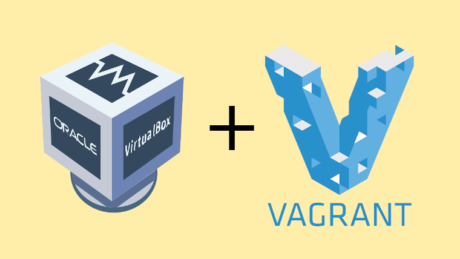

# DevOps Projects

## Descrição

Meu portfólio DevOps, consiste em um repositório que é gerenciado pelo Git, onde cada branch do projeto é equivalente a uma camada de estudos da área de DevOps, tendo neste projeto o seguinte:

- Scripts em Python e Bash
- Virtualização utilizando Vagrant
- Administração de sistemas e conceitos de redes
- Containerização utilizando Docker e Kubernetes
- CI/CD utiizando Jenkins em microsserviços
- IaaC com ferramentas como Ansible e Terraform
- Diversas soluções da AWS, como EC2, S3, Cloudformation e etc.

# Tabela de conteúdo

- [Tabela de Conteudo](#tabela-de-conteudo)
  - [Branches](#branches)
    - [Introdução às máquinas virtuais](#introducao-vms)
    - [Setup Local](#setup-local)
  - [Tecnologias](#tecnologias)

## Branches

### Introdução VMs

Nesta branch está hospedado 8 máquinas virtuais, utilizando o Vagrant sendo cada uma uma variante da
forma que eu fiz, e dentro das pastas "ubuntu18" e "centos7" estão arquivos do histórico de comandos
usados, sendo também meu treino de
administração de sistemas

#### Pastas

- IaaC - VMs utilizando IaaC com scripts bash
  - website - Website estático hospedado usando apache httpd com script para automatizar o deploy
  - wordpress - Site feito em wordpress usando script para automatizar o deploy
- centos7 - Máquina virtual simples
- data - Pasta compartilhada entre algumas VMs
- multi-vm - Vagrantfile utilizando múltiplas VMs
- ubuntu18 - Máquina virtual simples
- website - Máquina virtual com serviço de httpd servindo uma página estática
- wordpress - Máquina virtual com wordpress instalado e configurado

## Tecnologias

As seguintes ferramentas e conceitos foram usados na construção do projeto:

- [Vagrant](https://www.vagrantup.com/)
- [Ubuntu18](https://ubuntu.com/)
- [Centos7](https://www.centos.org/)

### Autor

[Matheus Dantas Ricardo 😎](https://www.linkedin.com/in/matheus-dr/)

Feito por Matheus Dantas Ricardo 👋🏽 Entre em contato!

[matheus-dr@proton.me](mailto:matheus-dr@proton.me)

